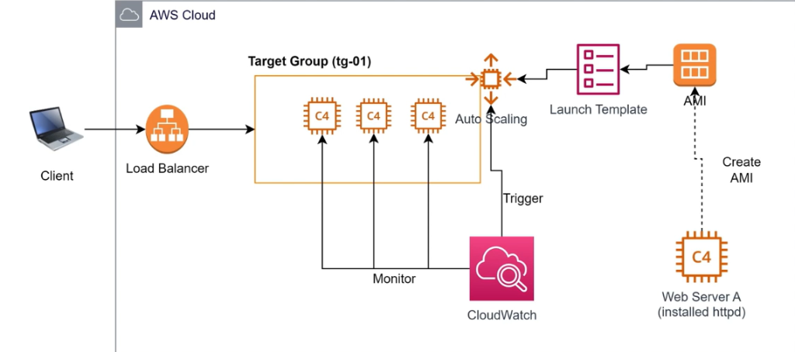
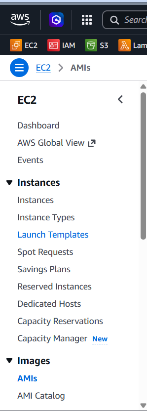
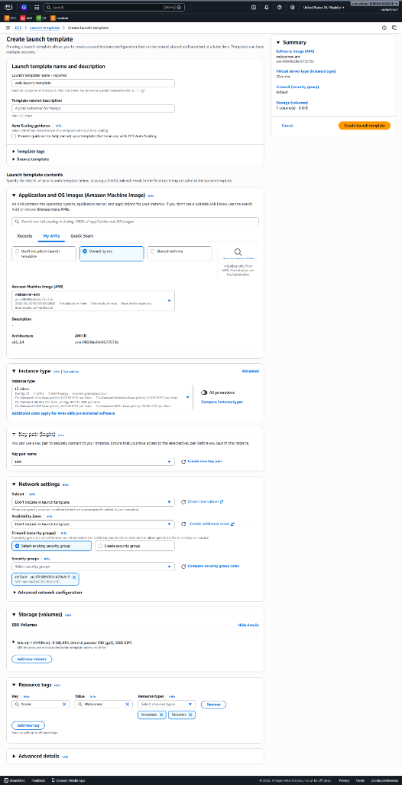

# Hướng Dẫn Thực Hành: Auto Scaling Group (Giai đoạn chuẩn bị Base Image)

Tài liệu này hướng dẫn chi tiết từng bước (step-by-step) cách thực hiện **Giai đoạn chuẩn bị Base Image** (hay còn gọi là tạo Golden Image) cho hệ thống Auto Scaling trên AWS. Đây là bước nền tảng để đóng gói cấu hình máy chủ, giúp Auto Scaling tự động nhân bản (Scale Out) các máy chủ ảo EC2 giống hệt nhau khi có yêu cầu.

## Sơ đồ kiến trúc giai đoạn chuẩn bị

Dưới đây là sơ đồ mô tả luồng hoạt động từ một máy chủ web gốc cho đến khi đóng gói thành bản AMI làm cơ sở dữ liệu cho Launch Template của Auto Scaling Group:



*Hình 1: Luồng đóng gói máy chủ Web Server A chứa dịch vụ Apache (httpd) thành AMI để cung cấp cho Launch Template.*

---

## Các bước thực hiện chi tiết

### Bước 1: Truy cập máy chủ gốc qua SSH (Vào EC2)

Để cấu hình máy chủ đóng vai trò là "bản thiết kế gốc" (Golden Image) cho tất cả các máy ảo con sau này, trước hết ta cần đăng nhập trực tiếp vào hệ điều hành của instance đó.

1. Truy cập **AWS Management Console** -> Chọn dịch vụ **EC2** -> Chọn **Instances**.
2. Tích chọn máy chủ gốc của bạn (ví dụ: `my-server-a`), nhấp chọn nút **Connect**.
3. Tại giao diện kết nối, chọn tab **SSH client**. Bạn sẽ thấy hướng dẫn kết nối kèm theo ví dụ lệnh SSH mẫu ở phía dưới.
   
   
   
   *Hình 2: Lấy thông tin tài khoản và địa chỉ DNS công khai để SSH trên AWS Console.*

4. Mở cửa sổ dòng lệnh (**Command Prompt** hoặc **Windows PowerShell**) trên máy tính cá nhân của bạn, di chuyển đến thư mục chứa file khóa bảo mật (ví dụ: `test.pem`).
5. Thực thi lệnh SSH để đăng nhập vào máy chủ.
   
   > [!WARNING]
   > **Xử lý sự cố Connection timed out (Cổng 22)**:
   > Trong thực tế, bạn có thể gặp phải lỗi `ssh: connect to host ... port 22: Connection timed out` như hình dưới đây. Nguyên nhân phổ biến nhất là do **Security Group** của máy chủ chưa cho phép cổng 22 nhận traffic từ IP của bạn, hoặc đường truyền mạng internet đang bị chặn. Hãy kiểm tra lại Inbound Rules của Security Group và cập nhật luật SSH từ nguồn IP của bạn (`My IP`).

   
   
   *Hình 3: Thực hiện kết nối SSH qua Windows PowerShell (khắc phục lỗi timeout cổng 22 thành công).*

---

### Bước 2: Kích hoạt tự khởi động cho dịch vụ Web (Enable httpd)

Khi máy chủ mới được sinh ra bởi Auto Scaling, hệ thống cần tự động hoạt động ngay lập tức mà không cần bất kỳ sự can thiệp thủ công nào từ quản trị viên. Do đó, việc cấu hình để dịch vụ web (Apache - httpd) khởi động cùng hệ điều hành là bắt buộc.

1. Sau khi SSH thành công vào instance, thực thi lệnh sau để kích hoạt dịch vụ tự khởi chạy cùng OS:
   ```bash
   sudo systemctl enable httpd
   ```
   *(Hoặc sử dụng lệnh legacy `sudo chkconfig httpd on` tùy thuộc vào phiên bản hệ điều hành của bạn)*.
   
2. **Tại sao bước này lại quan trọng?**
   * **Bản chất**: Khi xảy ra sự kiện **Scale Out** (tăng tải, cần thêm máy chủ), Auto Scaling Group sẽ tự động tạo thêm (launch) các instance mới tinh. Lúc đó sẽ không có quản trị viên nào rảnh rỗi để SSH vào từng máy ảo con và gõ lệnh start dịch vụ web.
   * Lệnh `enable` đảm bảo rằng ngay khi hệ điều hành ảo của instance mới vừa boot xong, dịch vụ Apache web server (`httpd`) sẽ tự động được khởi động lên và sẵn sàng nhận traffic phân phối từ Load Balancer.

---

### Bước 3: Tạo AMI (Amazon Machine Image) từ Instance đang chạy

Sau khi đã cài đặt và cấu hình hoàn tất máy chủ gốc (bao gồm việc `enable httpd`), chúng ta tiến hành đóng gói toàn bộ trạng thái hiện tại của máy chủ thành một Base Image (khuôn mẫu).

1. Quay lại danh sách **Instances** trên EC2 Console.
2. Tích chọn máy chủ gốc `my-server-a` -> Nhấp chọn nút **Actions** ở menu phía trên -> Chọn **Image and templates** -> Chọn **Create image**.

   
   
   *Hình 4: Chọn tính năng tạo ảnh máy ảo (AMI) từ instance đang chạy.*

3. **Cấu hình chi tiết AMI**:
   * **Image name**: Đặt tên gợi nhớ cho bản đóng gói (ví dụ: `webserver-ami`).
   * **Image description**: Mô tả ngắn gọn (ví dụ: `Base image with httpd auto-start enabled for ASG`).
   * **Reboot instance**: 
     * **Tích chọn (Reboot)**: AWS sẽ khởi động lại EC2 instance trước khi tiến hành chụp Snapshot của ổ đĩa. Cách này giúp đảm bảo tính toàn vẹn dữ liệu (data consistency) cao nhất vì hệ điều hành đã được tắt an toàn và không có dữ liệu nào đang ghi dở.
     * **Bỏ tích (No reboot)**: AWS sẽ tạo ảnh trực tiếp mà không tắt máy chủ. Dịch vụ của bạn không bị gián đoạn (no downtime), tuy nhiên có nguy cơ mất mát dữ liệu nhỏ nếu có tiến trình đang ghi đĩa dở dang tại thời điểm chụp ảnh.
   * **Instance volumes**: Giữ nguyên thông số dung lượng ổ đĩa EBS mặc định gắn kèm.

   
   
   *Hình 5: Thiết lập tên AMI và tùy chọn Reboot trước khi khởi tạo ảnh.*

4. Nhấp chọn **Create image** để hoàn tất. Hệ thống sẽ bắt đầu đóng gói và bạn có thể theo dõi trạng thái AMI mới này tại mục **Images** -> **AMIs** ở thanh điều hướng bên trái.

Bản AMI này giờ đây đã chứa toàn bộ mã nguồn ứng dụng, cấu hình hệ thống, và cấu hình tự động chạy của dịch vụ `httpd`. Đây chính là "Base Image" chuẩn để chúng ta sử dụng làm thông tin đầu vào cho **Launch Template** ở các bước tiếp theo.

---

### Bước 4: Khởi tạo Launch Template (Mẫu cấu hình khởi chạy)

**Launch Template (Mẫu cấu hình khởi chạy)** đóng vai trò là bản thiết kế hướng dẫn chi tiết để EC2 Auto Scaling Group biết cách khởi chạy (launch) các EC2 instances con một cách tự động khi có yêu cầu Scale Out hoặc Self-healing.

1. Tại thanh điều hướng bên trái của dịch vụ EC2, cuộn đến mục **Instances** -> Chọn **Launch Templates**.
   
   
   
   *Hình 6: Truy cập menu Launch Templates từ sidebar quản trị EC2.*

2. Nhấp chọn nút **Create launch template** ở góc trên cùng bên phải.
3. **Cấu hình thông số Launch Template chi tiết**:
   * **Launch template name**: `web-launch-template`
   * **Template version description**: Mô tả ngắn gọn (ví dụ: `A prod webserver for MyApp`).
   * **Auto Scaling guidance**: Tích chọn checkbox **Provide guidance to help me set up a template that I can use with EC2 Auto Scaling**. Tùy chọn này giúp AWS tối ưu hóa giao diện và cấu hình tương thích nhất cho ASG.
   * **Application and OS Images (Amazon Machine Image)**:
     * Nhấp chọn tab **My AMIs** -> Chọn mục **Owned by me**.
     * Hệ thống sẽ tự động hiển thị bản **AMI** (`webserver-ami`) mà bạn đã đóng gói ở **Bước 3**. Hãy tích chọn nó.
   * **Instance type**: Chọn loại `t2.micro` (hoặc cấu hình phần cứng tương đương với nhu cầu của bạn).
   * **Key pair (login)**: Chọn cặp khóa bảo mật `.pem` của bạn (ví dụ: `test`) để có thể SSH quản trị instances con khi cần thiết.
   * **Network settings**:
     * **Subnet (Mạng con)**: Chọn **Don't include in launch template** (Không đưa vào template).
       
       > [!NOTE]
       > **Lưu ý quan trọng**: Ta để trống Subnet tại Launch Template để nhường quyền quyết định phân phối đều máy chủ con qua nhiều Availability Zones khác nhau cho Auto Scaling Group cấu hình ở bước sau.
       
     * **Firewall (security groups)**: Chọn **Select existing security group** và tìm đến Security Group mong muốn (ví dụ: nhóm bảo mật `default` đã cấu hình mở cổng 80 và 22 ở các bài lab trước).
   * **Resource tags**: Nhấp chọn **Add new tag** để đặt nhãn tự động gắn cho các instances ảo được tạo ra sau này:
     * **Key**: `Name` | **Value**: `Webserver`
     * **Resource types**: Tích chọn cả **Instances** và **Volumes**.

   
   
   *Hình 7: Thiết lập các thông số cấu hình cốt lõi cho Launch Template trên AWS Console.*

4. Cuộn xuống và nhấp chọn nút **Create launch template** ở góc phải màn hình để hoàn tất khởi tạo.

Mẫu cấu hình Launch Template này hiện đã sẵn sàng và liên kết với bản AMI gốc. Ở giai đoạn tiếp theo, ta sẽ dùng mẫu này để thiết lập cấu hình co giãn tự động hoàn chỉnh cho Auto Scaling Group.
