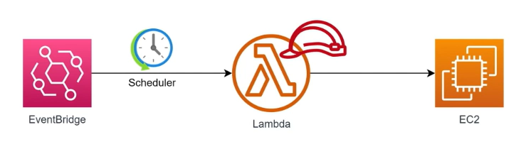

# 3. AWS Lambda Hands-on Lab (Tự động bật/tắt máy chủ EC2 để tiết kiệm chi phí) - Đề bài

## I. Tổng quan bài Lab (Yêu cầu)

Trong môi trường phát triển (Development / Testing), các máy chủ ảo EC2 thường chỉ cần hoạt động trong giờ làm việc hành chính. Để tối ưu hóa chi phí, bài Lab này yêu cầu bạn thiết lập giải pháp tự động hóa bật/tắt máy chủ EC2 theo lịch biểu sử dụng Amazon EventBridge và AWS Lambda.

**Sơ đồ kiến trúc:**

  

### Yêu cầu cụ thể:
1. **AWS Lambda**:
   * Viết hàm Lambda bằng Python (`boto3`) để thực hiện bật/tắt một máy chủ EC2 cụ thể.
   * Hàm Lambda nhận 2 tham số đầu vào từ Event:
     * `instance_id`: ID của máy chủ EC2 cần bật/tắt.
     * `action`: Hành động cần thực hiện (`START` hoặc `STOP`).
2. **Amazon EventBridge**:
   * Thiết lập lịch biểu (Scheduler) để tự động kích hoạt Lambda theo thời gian chỉ định:
     * Tự động **STOP** máy chủ vào **19:00** tối hàng ngày.
     * Tự động **START** máy chủ vào **07:00** sáng hôm sau.
   * Khi kích hoạt Lambda, EventBridge sẽ truyền payload JSON chứa 2 tham số cần thiết (`instance_id` và `action`).

---

## II. Hướng dẫn chi tiết

Vui lòng xem các bước triển khai chi tiết tại:
👉 **[Hướng dẫn thực hành chi tiết (README.md)](README.md)**

---

* **Bài trước**: [2. AWS Lambda Hands-on Lab(Resize Image on S3) (Lab Resize ảnh trên S3)](../2.%20AWS%20Lambda%20Hands-on%20Lab%28Resize%20Image%20on%20S3%29/2.%20AWS%20Lambda%20Hands-on%20Lab%28Resize%20Image%20on%20S3%29.md)
* **Bài tiếp theo**: [4. AWS Lambda Hands-on Lab(Read CSV and Save to DynamoDB) (Lab đọc CSV lưu vào DynamoDB)](../4.%20AWS%20Lambda%20Hands-on%20Lab%28Read%20CSV%20and%20Save%20to%20DynamoDB%29/4.%20AWS%20Lambda%20Hands-on%20Lab%28Read%20CSV%20and%20Save%20to%20DynamoDB%29.md)
