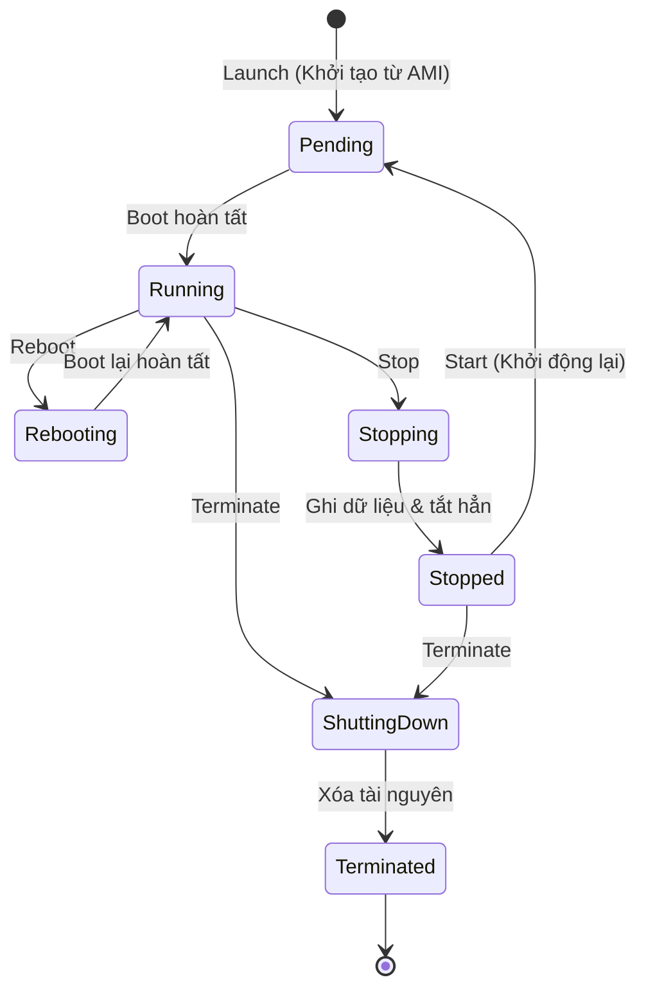
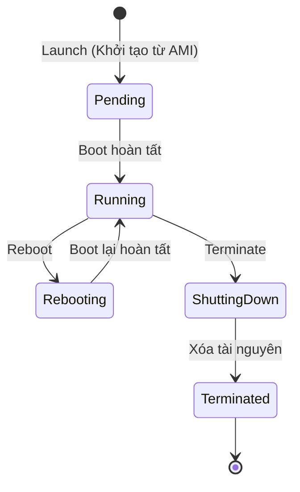

# Vòng đời và các thao tác cơ bản trên Amazon EC2

Bên cạnh các khái niệm cốt lõi, việc nắm vững vòng đời (Lifecycle) của một EC2 Instance và các thao tác quản trị cơ bản là yếu tố quyết định để tối ưu hóa chi phí, bảo mật và hiệu năng khi vận hành hệ thống trên AWS.

---

## I. Vòng đời của EC2 Instance sử dụng EBS Volume (Mặc định)

Khi hoạt động, một EC2 instance sử dụng **EBS Volume làm Root Volume** (mặc định cho hầu hết các instance hiện nay) sẽ trải qua các trạng thái khác nhau kể từ lúc khởi tạo cho đến khi bị xóa bỏ hoàn toàn.

### 1. Chi tiết các trạng thái vòng đời

| Trạng thái | Mô tả | Trạng thái tính phí | Ảnh hưởng tới IP | Ảnh hưởng tới dữ liệu |
| :--- | :--- | :--- | :--- | :--- |
| **Pending** | Instance đang được chuẩn bị (cấp phát phần cứng, thiết lập mạng). | Không tính phí Compute. | Đang cấp phát IP. | Đang chuẩn bị ổ đĩa. |
| **Running** | Instance đang chạy và hoạt động bình thường. | **Tính phí Compute** (theo giây hoặc giờ). | Giữ nguyên Public IP, Private IP, Elastic IP. | Dữ liệu ghi/đọc bình thường trên EBS và Instance Store. |
| **Rebooting** | Instance đang được khởi động lại (tương đương lệnh `reboot` trong OS). | **Vẫn tính phí Compute** liên tục. | **Giữ nguyên mọi IP** (cả Public và Private). | Dữ liệu trên RAM có thể mất; dữ liệu trên EBS và Instance Store **được bảo toàn**. |
| **Stopping** | Instance đang trong quá trình tắt máy tạm thời. | Không tính phí Compute. | Đang thu hồi Public IP. | Chuẩn bị ngắt kết nối ổ đĩa. |
| **Stopped** | Instance đã tắt hoàn toàn. | **Không tính phí Compute**. Vẫn tính phí lưu trữ EBS và các tài nguyên liên đới (Elastic IP nếu không gắn vào instance nào). | **Mất Public IP** (sẽ đổi IP mới khi Start lại). Private IP và Elastic IP được giữ nguyên. | Dữ liệu trên EBS **được bảo toàn**. Dữ liệu trên Instance Store (ổ đĩa tạm thời) **bị xóa sạch**. |
| **Shutting-down** | Instance đang trong quá trình xóa vĩnh viễn. | Không tính phí Compute. | Thu hồi toàn bộ IP về pool của AWS. | Bắt đầu xóa các ổ đĩa liên kết. |
| **Terminated** | Instance đã bị xóa hoàn toàn và không thể khôi phục. | Không tính phí Compute. Bản ghi cấu hình sẽ biến mất khỏi bảng điều khiển sau vài giờ. | Mất toàn bộ IP liên kết. | Dữ liệu trên Instance Store bị xóa. Dữ liệu trên EBS bị xóa nếu thuộc tính `DeleteOnTermination` được bật (mặc định là bật cho Root Volume). |

---

## II. Vòng đời của EC2 Instance sử dụng Instance Store Volume

Ngoài việc hỗ trợ ổ cứng mạng EBS Volume, AWS EC2 còn hỗ trợ **Instance Store Volume** (còn gọi là ổ cứng tạm thời - Ephemeral Disk). Ổ đĩa này được gắn trực tiếp vật lý vào máy vật chủ (Host machine) chứa EC2 Instance.

### 1. Đặc điểm nổi bật
*   **Hiệu năng cực cao (High IOPS)**: Do kết nối trực tiếp vật lý qua chuẩn bus tốc độ cao (như NVMe SSD), ổ Instance Store cung cấp tốc độ đọc/ghi ngẫu nhiên (IOPS) cao hơn và độ trễ thấp hơn rất nhiều so với EBS Volume truyền qua mạng.
*   **Tính chất tạm thời (Ephemeral)**: Dữ liệu trên ổ Instance Store chỉ tồn tại trong suốt vòng đời của Instance đang chạy. Dữ liệu sẽ **bị xóa sạch vĩnh viễn** khi instance bị Stop hoặc Terminate.
*   **Trường hợp sử dụng phù hợp**:
    *   Lưu trữ dữ liệu tạm thời (Scratch data), bộ đệm (Buffers, Caches).
    *   Lưu các dữ liệu được đồng bộ hóa/sao chép trực tuyến qua mạng (Replicated data) như các nút trong một cụm cơ sở dữ liệu phân tán (Cassandra, MongoDB, Elasticsearch).

### 2. Các lưu ý quan trọng đối với Instance Store
*   **Không thể dừng tạm thời (No Stop/Start)**:
    *   Đối với các instance sử dụng ổ **Instance Store làm Root Volume (boot volume)**, bạn **không thể thực hiện thao tác Stop tạm thời**.
    *   Hành động Stop sẽ bị vô hiệu hóa trên AWS Console/CLI. Bạn chỉ có 3 thao tác điều khiển chính là **Launch (Khởi chạy)**, **Reboot (Khởi động lại)** và **Terminate (Xóa vĩnh viễn)**.
*   **Giới hạn cấu hình**:
    *   Chỉ một số dòng **Instance Type nhất định** (ví dụ: dòng `I` - Storage Optimized, dòng `C` hoặc `R` có hậu tố `d` như `c5d`, `r5d`) mới được trang bị sẵn ổ đĩa này.
    *   Yêu cầu các **AMI tương thích** hỗ trợ cấu hình ánh xạ thiết bị lưu trữ (Block Device Mapping) của Instance Store.
*   **Khi nào dữ liệu bị mất trên Instance Store?**
    *   Khi ổ đĩa vật lý của máy host bên dưới bị lỗi phần cứng.
    *   Khi EC2 instance bị **Terminate**.
    *   Đối với các instance sử dụng EBS làm Root Volume nhưng có gắn kèm thêm các ổ Instance Store phụ: Dữ liệu trên ổ Instance Store phụ cũng sẽ **bị xóa sạch** mỗi lần instance bị **Stop/Start**.

---

## III. Các thao tác cơ bản với EC2

Các thao tác cơ bản để quản trị và tương tác với EC2 có thể chia làm 3 nhóm chính:

### 1. Nhóm thao tác điều khiển trạng thái (State Control)

*   **Launch Instance (Khởi tạo Instance)**: Tạo mới một máy chủ ảo từ một **AMI (Amazon Machine Image)** nguồn đã chọn.
*   **Reboot Instance (Khởi động lại)**: Khởi động lại hệ điều hành của Instance mà không làm thay đổi phần cứng vật lý bên dưới. Khuyên dùng cho các tác vụ cập nhật OS thông thường vì thời gian khởi động nhanh và giữ nguyên mọi IP.
*   **Stop Instance (Tạm dừng)**: Tắt tạm thời máy chủ ảo khi không sử dụng nhằm tiết kiệm chi phí Compute (chỉ áp dụng cho các instance sử dụng ổ lưu trữ **EBS-backed**).
*   **Start Instance (Khởi động lại từ trạng thái dừng)**: Bật lại instance từ trạng thái `Stopped`. AWS sẽ cấp phát tài nguyên phần cứng mới để khởi chạy lại. Mỗi lần Start lại, instance sẽ nhận một **Public IP mới**, trừ khi bạn gắn một **Elastic IP (IP tĩnh)** cố định.
*   **Terminate Instance (Xóa vĩnh viễn)**: Xóa hoàn toàn máy chủ ảo và giải phóng mọi tài nguyên đi kèm. Hành động này không thể đảo ngược.

### 2. Nhóm thao tác liên kết tài nguyên (Attach/Detach)

*   **Attach/Detach Volume (Gắn/Gỡ ổ đĩa lưu trữ EBS)**: Gắn thêm ổ đĩa cứng ảo (EBS Volume) vào máy chủ ảo để tăng không gian lưu trữ hoặc tháo ra mà không làm mất dữ liệu. Volume và EC2 Instance bắt buộc phải thuộc **cùng một Availability Zone (AZ)**.
*   **Attach/Detach Elastic IP (Gắn/Gỡ địa chỉ IP tĩnh)**: Gán địa chỉ IPv4 tĩnh công cộng (Elastic IP) cho EC2. Giúp định danh không đổi cho máy chủ ảo ngay cả khi Stop/Start. AWS tính phí đối với các Elastic IP để trống không liên kết với instance nào đang chạy.
*   **Attach/Detach Security Group (Gắn/Gỡ nhóm bảo mật)**: Cấu hình thêm hoặc bớt các nhóm tường lửa ảo (Security Group) vào cổng mạng của Instance để kiểm soát lưu lượng truy cập Inbound/Outbound.
*   **Attach/Detach IAM Role (Gắn/Gỡ quyền truy cập dịch vụ)**: Cấp các quyền bảo mật tạm thời cho ứng dụng đang chạy trên EC2 instance để gọi các dịch vụ AWS khác (như S3, RDS, DynamoDB) mà không cần lưu trữ Access Keys cứng.

### 3. Nhóm thao tác sao lưu và tạo bản mẫu (Backup & Template)

*   **Create Snapshot từ Volume**: Tạo bản sao lưu của một EBS Volume tại một thời điểm nhất định. Snapshots được lưu trữ trên S3 dưới dạng gia tăng (Incremental Backup), giúp tối ưu dung lượng và chi phí.
*   **Create AMI từ EC2 Instance**: Tạo một ảnh đĩa (Image) hoàn chỉnh chứa cấu hình hệ thống, hệ điều hành và tất cả các ổ đĩa dữ liệu của instance đó. Bản AMI này dùng để nhân bản (Clone) hoặc làm template cho hệ thống Auto Scaling.
