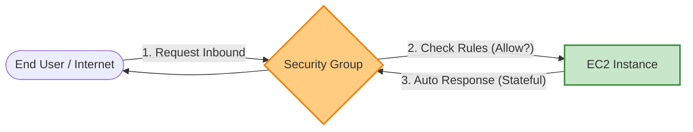
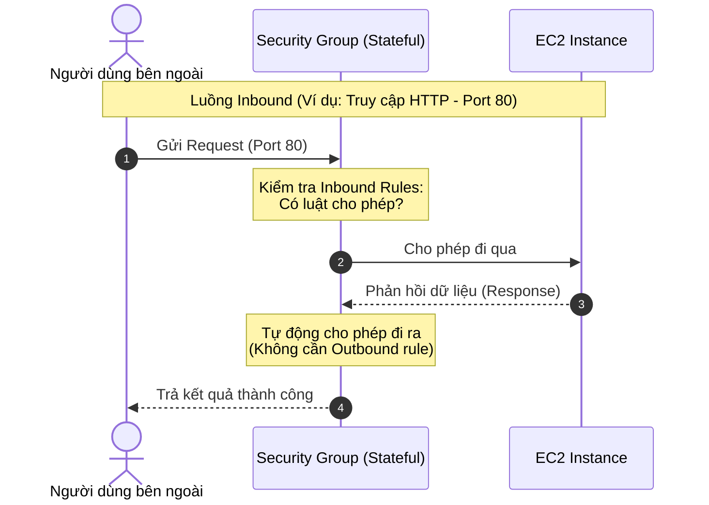

# Amazon EC2 Security Group

**Security Group (SG)** hoạt động như một tường lửa ảo (virtual firewall) ở cấp độ **Instance** (cụ thể là cấp độ cổng mạng ảo - Elastic Network Interface - ENI) nhằm kiểm soát chặt chẽ lưu lượng mạng đi vào (Inbound) và đi ra (Outbound) của các máy chủ ảo EC2.

---

## I. Nguyên lý hoạt động của Security Group

Khi có lưu lượng mạng (traffic) kết nối giữa EC2 Instance và môi trường bên ngoài (end-user, Internet, hoặc các tài nguyên khác trong AWS), Security Group sẽ đóng vai trò chốt chặn kiểm tra quyền truy cập.

1.  **Kiểm soát chiều đi vào (Inbound Traffic)**: Khi người dùng cuối (end-user) hoặc một hệ thống khác muốn kết nối tới EC2 Instance, Security Group sẽ đối chiếu thông tin kết nối với các luật đi vào (**Inbound Rules**) để quyết định cho phép kết nối hay chặn lại.
2.  **Kiểm soát chiều đi ra (Outbound Traffic)**: Khi bản thân EC2 Instance thực hiện yêu cầu kết nối tới một máy chủ bên ngoài (như tải gói cập nhật hệ điều hành, gọi API bên thứ ba), Security Group sẽ kiểm tra các luật đi ra (**Outbound Rules**).

---

## II. Các đặc điểm cốt lõi của Security Group

Để vận hành Security Group hiệu quả và bảo mật, cần nắm rõ 4 đặc tính quan trọng sau:

### 1. Tính trạng thái (Stateful)
*   **Định nghĩa**: Security Group là tường lửa dạng **Stateful** (lưu giữ trạng thái kết nối).
*   **Cơ chế**:
    *   Nếu một yêu cầu kết nối (Request) đi vào được cho phép bởi Inbound rule, thì lưu lượng phản hồi (**Response**) của kết nối đó sẽ **tự động được phép đi ra ngoài** mà bạn không cần phải khai báo thêm bất kỳ Outbound rule nào.
    *   Ngược lại, nếu EC2 chủ động gửi request đi ra ngoài được chấp nhận bởi Outbound rule, luồng dữ liệu phản hồi đi ngược lại vào trong cũng **tự động được cho phép** mà không cần cấu hình Inbound rule tương ứng.

### 2. Cấu hình mặc định (Default Behavior)
*   **Inbound**: Mặc định, một Security Group mới được tạo ra sẽ **chặn toàn bộ lưu lượng đi vào (Deny All Inbound)**. Bạn phải chủ động thêm các luật cho phép tương ứng với từng cổng kết nối (ví dụ: Port 22 cho SSH, Port 80/443 cho Web).
*   **Outbound**: Mặc định, Security Group sẽ **mở toàn bộ lưu lượng đi ra ngoài (Allow All Outbound - 0.0.0.0/0)**. Nếu không có yêu cầu bảo mật đặc biệt, bạn có thể giữ nguyên cấu hình này để instance tự do truy cập Internet/dịch vụ khác.

### 3. Cơ chế Allow-only (Chỉ có luật cho phép)
*   **Định nghĩa**: Các quy tắc trong Security Group **chỉ cho phép hành động Allow** (Cho phép), hoàn toàn **không hỗ trợ hành động Deny** (Cấm cụ thể).
*   **Cơ chế hoạt động**: Mọi lưu lượng không được định nghĩa tường minh trong danh sách các rule cho phép sẽ mặc định bị từ chối (đây gọi là cơ chế **Implicit Deny**).
*   *Lưu ý*: Bạn không thể sử dụng Security Group để cấm cụ thể một địa chỉ IP (ví dụ: Chặn IP phá hoại `1.2.3.4`). Để thực hiện chặn IP cụ thể, bạn cần sử dụng **Network ACL (NACL)** hoạt động ở cấp độ Subnet.

### 4. Đa liên kết (Multiple Security Groups)
*   Một EC2 Instance (hoặc chính xác là một card mạng ảo ENI) có thể được **gắn nhiều Security Group cùng một lúc** (tối đa mặc định là 5 SG).
*   Khi đánh giá lưu lượng truy cập, AWS sẽ **gộp chung tất cả các rule** từ toàn bộ các Security Group được liên kết lại để đưa ra quyết định cuối cùng. Chỉ cần một trong số các SG cho phép kết nối đó, kết nối sẽ được thông qua.
