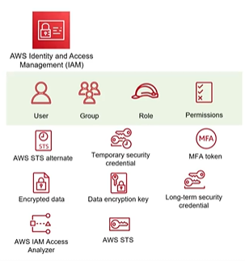

# Các Khái Niệm Cốt Lõi Của AWS IAM (IAM Concept)

Để thiết kế & xây dựng hệ thống trên AWS đảm bảo tiêu chí về Security cũng như không (0) gặp trouble, ta cần nắm các (~) concept cơ bản của IAM:

---

## I. Sơ đồ các khái niệm cốt lõi (IAM Core Concepts)

---

## II. Chi tiết các khái niệm cơ bản

### 1. User (Người dùng)
*   **Định nghĩa**: Là một thực thể danh tính được tạo ra trong AWS đại diện cho một người dùng cụ thể (nhân viên, quản trị viên) hoặc một dịch vụ/ứng dụng cần tương tác trực tiếp với tài nguyên AWS.
*   **Thông tin xác thực**: User đăng nhập bằng Console qua Username/Password hoặc truy cập API/CLI qua Access Key ID và Secret Access Key.

### 2. Group (Nhóm người dùng)
*   **Định nghĩa**: Là một tập hợp của nhiều IAM Users có chung mục đích công việc.
*   **Lợi ích**: Giúp quản lý phân quyền dễ dàng hơn. Thay vì gán chính sách cho từng User riêng lẻ, bạn chỉ cần gán quyền cho Group, tất cả các thành viên trong Group đó sẽ tự động kế thừa (inherit) quyền hạn.

### 3. Role (Vai trò)
*   **Định nghĩa**: Là một danh tính ảo có chứa các quyền hạn cụ thể nhưng không có thông tin đăng nhập tĩnh cố định.
*   **Cách sử dụng**: Thường được giả lập (assume) bởi các đối tượng khác như IAM Users, các dịch vụ của AWS (ví dụ: cho phép EC2 Instance hoặc Lambda Function truy cập S3 Bucket) hoặc người dùng từ hệ thống bên ngoài (SAML/OpenID). Quyền hạn của Role có tính tạm thời.

### 4. Permission / Policy (Quyền hạn / Chính sách)
*   **Định nghĩa**: Là tài liệu định nghĩa quyền hạn (thường viết dưới dạng JSON) để quy định cụ thể xem ai được phép hoặc bị từ chối thực hiện hành động nào trên tài nguyên nào của AWS.
*   **Nguyên tắc**: Mặc định mọi tài nguyên đều bị cấm truy cập, chỉ khi có một chính sách (Policy) cho phép rõ ràng (Explicit Allow) thì quyền đó mới có hiệu lực.
