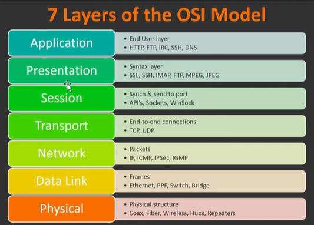
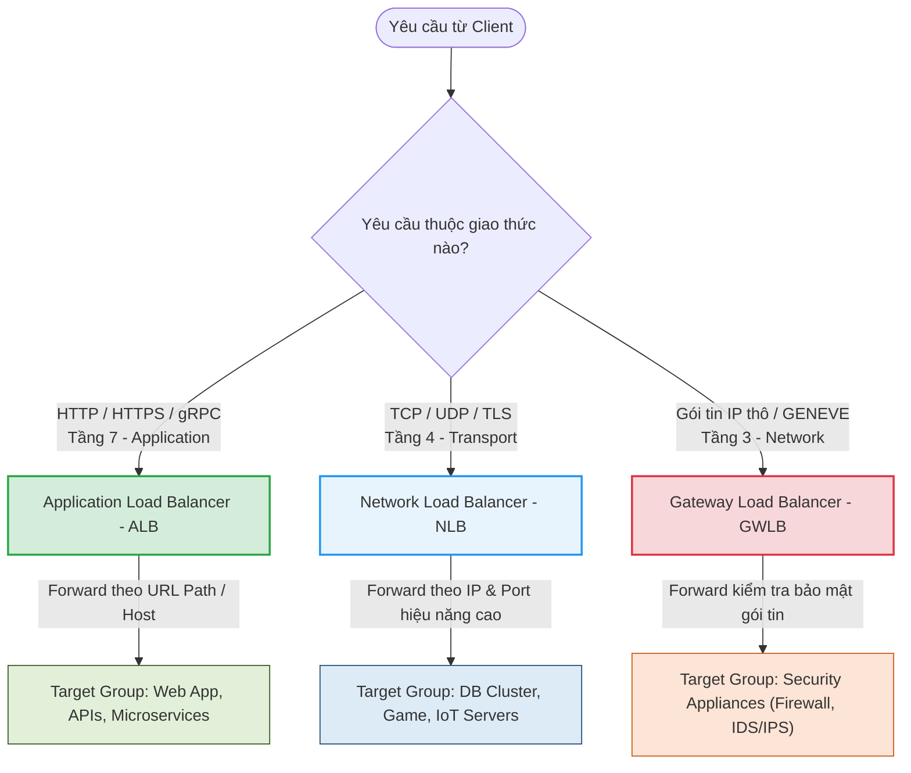

# Phân loại các dòng Elastic Load Balancer (ELB Types)

Trên dịch vụ đám mây AWS, Elastic Load Balancing (ELB) được chia thành nhiều loại khác nhau để tối ưu cho từng mục đích sử dụng. Tiêu chí phân loại chính phụ thuộc vào **tầng hoạt động (Layer) của Load Balancer trong mô hình OSI 7 layers**.

---

## I. Mô hình mạng OSI và Cơ sở phân loại ELB

Mô hình OSI (Open Systems Interconnection) là một mô hình chuẩn hóa gồm 7 tầng để định nghĩa cách thức truyền tải dữ liệu qua mạng. 

Các loại Load Balancer trên AWS hoạt động ở các tầng khác nhau và có khả năng "đọc" dữ liệu gói tin từ tầng đó trở xuống để đưa ra quyết định định tuyến:

*Hình 1: Sơ đồ 7 tầng của mô hình mạng OSI (Open Systems Interconnection).*

### Bảng tóm tắt các tầng OSI liên quan tới Load Balancing:

| Tầng (Layer) | Tên tiếng Anh | Dữ liệu xử lý chính | Thiết bị / Giao thức tiêu biểu | Dòng ELB tương ứng |
|---|---|---|---|---|
| **Layer 7** | Application (Ứng dụng) | Dữ liệu ứng dụng (HTTP headers, URL Path, Cookies, gRPC) | HTTP, HTTPS, DNS, SSH, FTP | **Application Load Balancer (ALB)** |
| **Layer 4** | Transport (Giao vận) | Các phân đoạn dữ liệu đầu-cuối (IP & Port) | TCP, UDP, TLS | **Network Load Balancer (NLB)** |
| **Layer 3** | Network (Mạng) | Các gói tin IP (IP Packets) | IP, ICMP, IPSec, GENEVE | **Gateway Load Balancer (GWLB)** |

---

## II. Chi tiết các dòng Elastic Load Balancer trên AWS

### 1. Application Load Balancer (ALB) - Hoạt động tại Layer 7

*   **Tầng hoạt động**: Tầng Ứng dụng (Layer 7).
*   **Giao thức hỗ trợ**: HTTP, HTTPS, HTTP/2, gRPC.
*   **Đặc điểm**:
    *   Có khả năng **đọc sâu** vào gói tin để hiểu các thông tin ứng dụng như: đường dẫn URL Path (vd `/api`), tên miền truy cập (vd `app.domain.com`), HTTP Headers, HTTP Cookies, hoặc Query string parameters.
    *   Hỗ trợ định tuyến thông minh (Content-based routing): Cho phép chuyển hướng yêu cầu tới các Target Group khác nhau dựa trên cấu trúc URL.
*   **Trường hợp sử dụng (Use Case)**:
    *   Các ứng dụng web truyền thống chạy trên giao thức HTTP/HTTPS.
    *   Kiến trúc Microservices (sử dụng Path-routing để điều hướng `/api/users` sang User Service, `/api/products` sang Product Service).
    *   Ứng dụng dạng SPA (Single Page Application) hoặc APIs cần cấu hình SSL Termination tập trung.

### 2. Network Load Balancer (NLB) - Hoạt động tại Layer 4

*   **Tầng hoạt động**: Tầng Giao vận (Layer 4).
*   **Giao thức hỗ trợ**: TCP, UDP, TLS.
*   **Đặc điểm**:
    *   Không quan tâm đến nội dung ứng dụng bên trong (không đọc URL, Cookies hay HTTP headers). NLB chỉ quan tâm đến thông tin ở tầng giao vận: **địa chỉ IP nguồn/đích** và **cổng kết nối (Port)**.
    *   **Hiệu năng cực cao**: Có độ trễ cực thấp (mức micro-seconds) và khả năng xử lý hàng triệu yêu cầu mỗi giây một cách ổn định, tự động xử lý tải bùng nổ (sudden volatile traffic).
    *   Hỗ trợ gán **Elastic IP** cố định cho từng Availability Zone của Load Balancer (rất quan trọng đối với các hệ thống yêu cầu cấu hình tường lửa whitelist IP cố định ở phía đối tác).
*   **Trường hợp sử dụng (Use Case)**:
    *   Hệ thống Database Clusters (như PostgreSQL, MySQL).
    *   Các dịch vụ truyền phát trực tiếp (Real-time streaming), Game server, MQTT server (IoT).
    *   Cần hiệu năng cao ở quy mô cực lớn hoặc yêu cầu địa chỉ IP tĩnh cố định ở đầu ngõ vào hệ thống.

### 3. Gateway Load Balancer (GWLB) - Hoạt động tại Layer 3

*   **Tầng hoạt động**: Tầng Mạng (Layer 3).
*   **Giao thức hỗ trợ**: GENEVE (cổng `6081`) và các gói tin IP thô.
*   **Đặc điểm**:
    *   Giúp triển khai, quản trị và mở rộng quy mô các thiết bị ảo bảo mật (Virtual Appliances) bên thứ ba một cách tập trung.
    *   Hoạt động như một gateway trung gian: nhận toàn bộ traffic ở tầng mạng (IP Layer), bọc gói tin lại và chuyển tiếp đến các thiết bị tường lửa/IDS/IPS để kiểm tra trước khi cho phép đi tiếp vào hệ thống đích.
*   **Trường hợp sử dụng (Use Case)**:
    *   Thiết lập cụm tường lửa ảo (Firewalls clusters), hệ thống phát hiện/ngăn ngừa xâm nhập (IDS/IPS - Intrusion Detection/Prevention Systems).
    *   Kiểm tra lưu lượng mạng chuyên sâu để phân tích bảo mật.

### 4. Classic Load Balancer (CLB) - Dòng cũ (Legacy)

*   **Tầng hoạt động**: Hoạt động ở cả Layer 4 và Layer 7.
*   **Đặc điểm**:
    *   Đây là dòng Load Balancer thế hệ đầu tiên của AWS (ra đời từ rất lâu).
    *   Thiếu các tính năng định tuyến thông minh của ALB và hiệu năng vượt trội của NLB.
*   **AWS Khuyến nghị**: **Không nên sử dụng CLB** cho các dự án mới. Hãy chuyển đổi sang ALB hoặc NLB để tối ưu chi phí và hiệu năng.

---

## III. Bảng so sánh nhanh giữa ALB, NLB và GWLB

| Tính chất | Application Load Balancer (ALB) | Network Load Balancer (NLB) | Gateway Load Balancer (GWLB) |
|---|---|---|---|
| **OSI Layer** | **Layer 7** (Application) | **Layer 4** (Transport) | **Layer 3** (Network) |
| **Giao thức chính** | HTTP, HTTPS, HTTP/2, gRPC | TCP, UDP, TLS | GENEVE |
| **Hiệu năng & Độ trễ** | Tốt (Độ trễ mili-seconds) | Cực tốt (Độ trễ micro-seconds) | Tốt (Độ trễ thấp) |
| **Định tuyến thông minh**| Có (Theo Path, Host, Headers, Query) | Không (Chỉ theo IP/Port) | Không (Chuyển tiếp gói tin IP) |
| **Địa chỉ IP cố định** | Không hỗ trợ (IP thay đổi động) | Có hỗ trợ (Gán Elastic IP tĩnh) | Có hỗ trợ |
| **Target hỗ trợ** | EC2, Container (ECS), IP, Lambda | EC2, Container (ECS), IP | EC2, IP (Virtual Appliances) |

---

## IV. Sơ đồ tư duy định tuyến cấp độ OSI

Sơ đồ dưới đây minh họa cách thức phân loại yêu cầu từ người dùng dựa trên giao thức/tầng mạng để đi tới dòng Load Balancer và các cụm server đích phù hợp:

