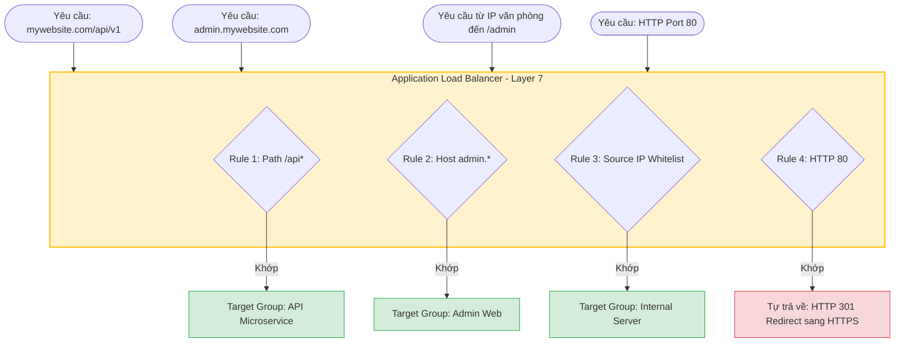

# Application Load Balancer (ALB)

**Application Load Balancer (ALB)** là dòng cân bằng tải được sử dụng phổ biến nhất trên AWS, phù hợp cho đa số các nhu cầu của ứng dụng web hiện đại.

---

## I. Tổng quan về Application Load Balancer

ALB hoạt động ở tầng **Layer 7 (Application)** của mô hình mạng OSI. Do hoạt động ở tầng ứng dụng, ALB có khả năng phân tích sâu nội dung bên trong gói tin truyền tải (như HTTP headers, URL, cookies, query string...) để đưa ra quyết định định tuyến một cách thông minh.

  

<em>Hình 1: Dòng dịch vụ Application Load Balancer (ALB) trên AWS.</em>

---

## II. Các ưu thế vượt trội của ALB (Layer 7 Advantages)

Nhờ khả năng xử lý thông tin ở tầng ứng dụng, ALB sở hữu các tính năng định tuyến vượt trội so với các Load Balancer thông thường:

### 1. Hỗ trợ định tuyến theo đường dẫn (Path-based Routing)
*   **Chi tiết**: ALB có thể đánh giá đường dẫn URL (Path) của yêu cầu gửi đến và chuyển tiếp tới các Target Group tương ứng.
*   **Ví dụ**: 
    *   Truy cập `website.com/api/*` sẽ được định tuyến tới **Target Group API** (chạy cụm server backend).
    *   Truy cập `website.com/static/*` sẽ được định tuyến tới **Target Group Tĩnh** (chạy cụm server chứa ảnh, JS, CSS).

### 2. Hỗ trợ định tuyến theo tên miền (Host-based Routing)
*   **Chi tiết**: ALB cho phép cấu hình nhiều tên miền khác nhau (Hostnames) cùng trỏ về một địa chỉ ALB duy nhất. ALB sẽ tự phân tích host header để chuyển tiếp tới Target Group thích hợp.
*   **Lợi ích**: Giúp tiết kiệm chi phí cấu hình nhiều Load Balancer cho từng dịch vụ riêng lẻ.
*   **Ví dụ**:
    *   `api.domain.com` -> Định tuyến tới Target Group API.
    *   `admin.domain.com` -> Định tuyến tới Target Group Quản trị.
    *   `domain.com` -> Định tuyến tới Target Group Landing Page.

### 3. Định tuyến dựa trên các thuộc tính của yêu cầu (Request Attributes Routing)
*   **Chi tiết**: ALB có thể phân tích và định tuyến traffic dựa trên bất kỳ thành phần nào của HTTP request như:
    *   **HTTP Headers** (vd định tuyến dựa trên thiết bị di động bằng `User-Agent`).
    *   **Query String Parameters** (các tham số trên URL, ví dụ `?version=v2` để chạy thử nghiệm tính năng mới).
    *   **Địa chỉ IP nguồn (Source IP CIDR)** (ví dụ: chỉ cho phép các dải IP nội bộ văn phòng được truy cập vào trang Admin).
    *   **HTTP Method** (phân loại GET, POST, DELETE để chuyển tới các dịch vụ tối ưu tương ứng).

### 4. Tích hợp đa dạng và mạnh mẽ với Container & Serverless
*   **Chi tiết**: ALB tương thích hoàn hảo với các dịch vụ chạy ứng dụng hiện đại:
    *   **Container**: Tích hợp chặt chẽ với Amazon ECS (Elastic Container Service) và EKS (Elastic Kubernetes Service), hỗ trợ cơ chế gán cổng động (Dynamic Port Mapping).
    *   **Serverless**: Cho phép gán trực tiếp **AWS Lambda** làm mục tiêu xử lý (target), giúp ALB kích hoạt hàm chạy mã nguồn trực tiếp khi nhận yêu cầu HTTP.

### 5. Hỗ trợ trả về phản hồi tùy chỉnh (Custom HTTP Response)
*   **Chi tiết**: ALB có thể trực tiếp trả về một HTTP code xác định (ví dụ: HTTP `200`, `301` redirect, `404`, `503`...) cùng với một trang nội dung tùy chỉnh dạng HTML hoặc văn bản JSON mà không cần phải chuyển tiếp yêu cầu đó xuống các máy chủ ứng dụng ở backend.
*   **Ứng dụng**: Rất hữu ích để cấu hình trang thông báo bảo trì, trang thông báo lỗi 404 thân thiện, hoặc cấu hình redirect tự động từ HTTP sang HTTPS (HTTP 301 Redirect).

---

## III. Sơ đồ minh họa định tuyến thông minh (Layer 7 Routing)

Sơ đồ dưới đây minh họa cách thức một ALB tiếp nhận nhiều yêu cầu khác nhau từ client, đánh giá qua các Rules cấu hình ở Layer 7 để chuyển hướng tới Target Group tương ứng hoặc trực tiếp tự phản hồi:

