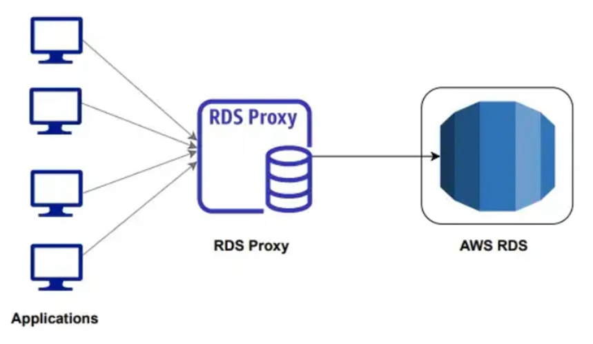

# 15. Amazon RDS Proxy (Trình quản lý kết nối Database)

Khi xây dựng các ứng dụng có lưu lượng truy cập lớn hoặc kiến trúc Serverless (ví dụ: sử dụng AWS Lambda), việc quản lý số lượng kết nối (connections) đồng thời tới cơ sở dữ liệu luôn là một thách thức lớn. Để giải quyết vấn đề này, AWS cung cấp giải pháp **Amazon RDS Proxy**.

---

## I. Amazon RDS Proxy là gì?

> **Amazon RDS Proxy** là một dịch vụ Database Proxy trung gian, được quản lý hoàn toàn và có tính sẵn sàng cao (High Availability) dành cho Amazon RDS và Amazon Aurora. 

RDS Proxy đóng vai trò như một bộ đệm đứng giữa ứng dụng (Application Layer) và các thực thể cơ sở dữ liệu (AWS RDS Instance/Cluster). Thay vì cho phép ứng dụng kết nối trực tiếp vào Database, mọi yêu cầu kết nối sẽ được gửi tới **Proxy Endpoint**, sau đó Proxy sẽ điều phối và chia sẻ các kết nối này tới database một cách tối ưu nhất.

---

## II. Các lợi ích cốt lõi của RDS Proxy

### 1. Quản lý kết nối hiệu quả (Connection Pooling & Multiplexing)
* **Vấn đề thực tế**: Mỗi kết nối trực tiếp đến database MySQL/PostgreSQL đều tiêu tốn tài nguyên RAM và CPU của máy chủ DB để duy trì trạng thái. Các ứng dụng web hoặc Serverless (AWS Lambda) thường tạo/xóa kết nối liên tục hoặc mở quá nhiều kết nối không dùng đến, gây ra hiện tượng nghẽn cổ chai (bottleneck) hoặc lỗi "Too many connections".
* **Giải pháp của RDS Proxy**:
  * Thực hiện **Connection Pooling**: Gom các kết nối và giữ chúng mở sẵn với database. Khi ứng dụng cần truy vấn, Proxy sẽ mượn một kết nối có sẵn từ pool để thực thi và trả lại ngay sau khi hoàn thành.
  * Giảm tải tới hơn **90%** dung lượng CPU và bộ nhớ tiêu hao cho việc mở/đóng kết nối trên máy chủ cơ sở dữ liệu.

### 2. Tăng cường khả năng dự phòng và khôi phục lỗi (Resiliency & Failover)
* Khi xảy ra sự cố failover (chuyển đổi từ Writer sang Reader node), thay vì làm ứng dụng bị lỗi kết nối hàng loạt và phải tự thực hiện logic thử lại (retry logic), RDS Proxy sẽ tự động định tuyến các yêu cầu truy vấn sang instance mới được thăng chức làm Writer.
* Giúp giảm thời gian gián đoạn kết nối khi failover lên đến **66%** đối với Amazon Aurora và Amazon RDS.

### 3. Bảo mật an toàn (Security)
* RDS Proxy cho phép cấu hình xác thực bằng **IAM Auth** giữa ứng dụng và proxy.
* Tích hợp chặt chẽ với **AWS Secrets Manager** để quản lý thông tin đăng nhập Database (Username/Password), giúp ứng dụng không cần phải lưu cứng mật khẩu trong mã nguồn hay biến môi trường.

---

## III. Các Database Engine được hỗ trợ

Hiện tại, Amazon RDS Proxy hỗ trợ 3 database engine phổ biến bao gồm:
1. **MySQL** (bao gồm cả Aurora MySQL)
2. **PostgreSQL** (bao gồm cả Aurora PostgreSQL)
3. **SQL Server**

---

## IV. Lưu ý về Chi phí

* Sử dụng RDS Proxy sẽ **phát sinh thêm chi phí bổ sung**.
* Chi phí được tính trên mỗi giờ hoạt động của Proxy, dựa trên số lượng **vCPU** của DB Instance hoặc Aurora DB Cluster bên dưới mà Proxy đang quản lý (không phụ thuộc vào số lượng kết nối từ ứng dụng tới Proxy).

---

* **Bài trước**: [14. Amazon RDS Hands-on Lab(Parameter Groups) (Lab 4)](14.%20Amazon%20RDS%20Hands-on%20Lab%28Parameter%29.md)
