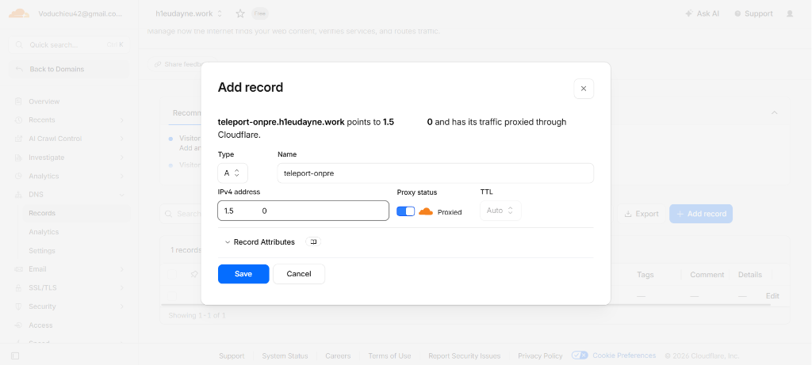

# Bài 5: Triển khai công cụ quản lý truy cập máy chủ (Teleport)

Tài liệu này hướng dẫn cách triển khai công cụ quản lý truy cập máy chủ tập trung (Teleport) trên môi trường On-Premise, bao gồm các bước cấu hình Load Balancer, trỏ DNS và cài đặt Nginx.

---

### I. Đánh giá phương án cài đặt Teleport trên On-Premise

Khi quyết định cài đặt công cụ quản lý truy cập (ví dụ: Teleport) trực tiếp trên hạ tầng On-Premise, cần cân nhắc kỹ các ưu điểm và nhược điểm sau:

*   **Ưu điểm:**
    *   Tận dụng trực tiếp hạ tầng nội bộ của doanh nghiệp, giúp tăng tính bảo mật và kiểm soát dữ liệu.
    *   Tạo tính đồng nhất trong việc quản trị và giám sát các luồng truy cập ra/vào hệ thống.
*   **Nhược điểm:**
    *   Nếu hệ thống On-Premise gặp lỗi hàng loạt (ví dụ: mất điện, mất mạng diện rộng, lỗi phần cứng), server Teleport cũng sẽ bị sập theo.
    *   Khi hạ tầng phân bố ở nhiều nơi (bao gồm cả Cloud hay các cụm Kubernetes cluster bên ngoài), việc mất kết nối tới Teleport On-Premise sẽ làm mất quyền kiểm soát toàn bộ hệ thống phân tán.

---

### II. Các bước triển khai ban đầu

#### 1. Chuẩn bị mô hình
Thiết lập bao gồm máy chủ Load Balancer (chạy Nginx) đóng vai trò làm Gateway tiếp nhận yêu cầu, phân phối lưu lượng và chuyển hướng truy cập tới các node Teleport phía sau.

#### 2. Trỏ tên miền (Domain) về IP Public
Để truy cập dịch vụ từ ngoài Internet qua giao diện Web hoặc Terminal Client, chúng ta cần liên kết một tên miền hoặc phụ miền (sub-domain) với địa chỉ IP Public của máy chủ.

1.  **Kiểm tra IP Public hiện tại của server:**
    Chạy lệnh sau trên terminal của server Teleport:
    ```bash
    curl -4 ifconfig.me
    ```
    *(Kết quả hiển thị địa chỉ IP Public dạng IPv4 của đường truyền mạng)*
    
    

2.  **Cấu hình DNS Record (Ví dụ trên Cloudflare):**
    *   Truy cập bảng quản trị DNS của nhà đăng ký tên miền.
    *   Thêm một bản ghi mới (**Add Record**).
    *   Điền các thông tin:
        *   **Type (Loại bản ghi):** `A`
        *   **Name (Tên miền phụ):** `teleport-onpre` (hoặc tên miền mong muốn, tạo thành FQDN `teleport-onpre.h1eudayne.work`).
        *   **IPv4 address (Địa chỉ IP):** Nhập IP Public vừa lấy được ở bước trên.
        *   **Proxy status:** Bật/Tắt đám mây Cloudflare Proxy (tùy thuộc nhu cầu ẩn IP gốc và sử dụng SSL/TLS của Cloudflare).
    *   Nhấn **Save** để lưu bản ghi.

    

#### 3. Setup Nginx Load Balancer
Cài đặt Nginx làm Proxy ngược (Reverse Proxy) / Load Balancer để tiếp nhận và phân phối các kết nối HTTP/HTTPS cũng như SSH tunnel của Teleport.

1.  **Cài đặt Nginx trên Ubuntu/Debian:**
    Cập nhật danh sách gói và cài đặt gói `nginx`:
    ```bash
    sudo apt update
    sudo apt install nginx -y
    ```
    
2.  **Kiểm tra trạng thái hoạt động:**
    Truy cập trực tiếp địa chỉ IP Private của máy chủ Load Balancer qua trình duyệt web (`http://<IP_load_balancer>`). Nếu hiển thị trang chào mừng mặc định của Nginx thì việc cài đặt ban đầu đã thành công.

    
