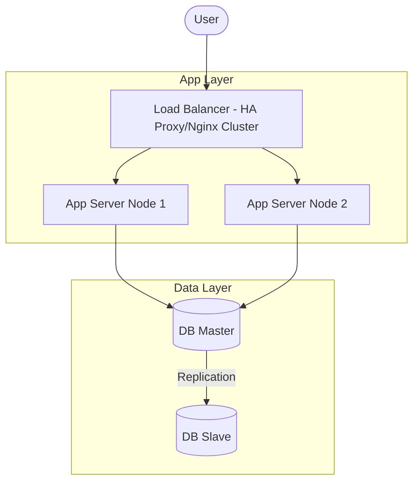

# 🏛️ Thiết Kế Hệ Thống Tính Sẵn Sàng Cao (High Availability Design)

Tính sẵn sàng cao (High Availability - HA) là một trong những mục tiêu tối quan trọng của System Architect, đảm bảo hệ thống vẫn hoạt động ổn định ngay cả khi có sự cố phần cứng, mạng hoặc phần mềm xảy ra.

---

## 🎯 Các Nguyên Tắc Thiết Kế HA

1. **Khử điểm lỗi đơn nhất (Eliminate Single Point of Failure - SPOF)**:
   * Mọi thành phần trong hệ thống đều phải có bản dự phòng (Redundancy). Nếu một server chết, server khác phải lập tức tiếp quản tải.
2. **Cơ chế phát hiện sự cố tự động (Automatic Failover)**:
   * Khi sự cố xảy ra, hệ thống phải tự phát hiện thông qua Health Checks và tự động chuyển đổi lưu lượng sang node dự phòng mà không cần can thiệp thủ công.
3. **Thiết kế không trạng thái (Stateless Services)**:
   * Tách biệt tầng logic ứng dụng khỏi tầng dữ liệu. Các ứng dụng Backend (Java, Node.js, Go) nên được thiết kế dưới dạng *Stateless* để có thể nhân bản và phân tải dễ dàng.

---

## 🗺️ Mô Hình Kiến Trúc HA Đơn Giản

---

## 🔗 Liên Kết Thực Hành DevOps
Để thực thi thiết kế HA này trên môi trường thực tế, bạn hãy tham khảo các tài liệu cấu hình mẫu sau:

*   **Load Balancing**: [Nginx Load Balancer Configuration](../../on-premise/kubernetes/load-balancer/nginx/k8s-loadbalancer.conf)
*   **Kubernetes HA Pod Replica**: [Kubernetes Deployment Template](../../on-premise/kubernetes/deployment/deployment-rolling.yml.example) (Sử dụng `replicas: 3` kết hợp với Rolling Update để đạt Zero-Downtime deployment).
*   **Database HA**: [MariaDB StatefulSet](../../on-premise/kubernetes/statefulset/) (Mô hình cluster lưu trữ trạng thái) và [Redis Sentinel Cluster](../../on-premise/kubernetes/redis/).
