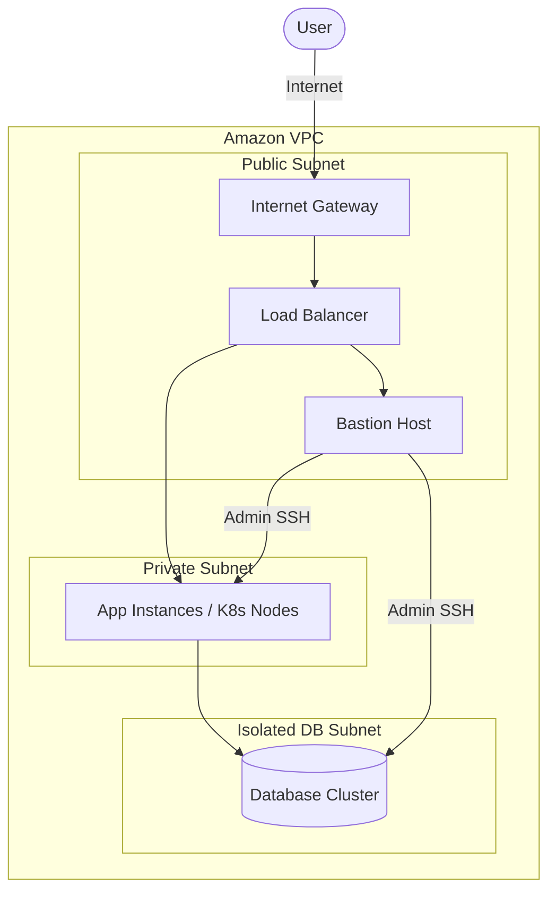

# 🔐 Kiến Trúc Bảo Mật (Security Architecture Design)

Bảo mật là một yếu tố nền tảng không thể tách rời trong vai trò System Architect. Thiết kế kiến trúc bảo mật tốt sẽ ngăn chặn các nguy cơ tấn công mạng, rò rỉ dữ liệu và đảm bảo tính tuân thủ.

---

## 🎯 Các Nguyên Tắc Thiết Kế Bảo Mật

1. **Nguyên tắc Đặc Quyền Tối Thiểu (Least Privilege)**:
   * Chỉ cấp quyền hạn vừa đủ để thực hiện một tác vụ cụ thể. Không dùng tài khoản Root cho các tác vụ hàng ngày.
2. **Phòng thủ theo chiều sâu (Defense in Depth)**:
   * Sử dụng nhiều lớp bảo mật ở các tầng khác nhau: từ Firewall mạng (VPC/Security Group), phân quyền danh tính (IAM), mã hóa dữ liệu (KMS) đến giám sát phát hiện bất thường (CloudTrail, GuardDuty).
3. **Phân vùng mạng (Network Segmentation)**:
   * Đặt các máy chủ cơ sở dữ liệu (Database) và xử lý nội bộ vào vùng mạng riêng tư (Private Subnet). Chỉ mở vùng mạng công cộng (Public Subnet) cho Load Balancer hoặc Bastion Host.

---

## 🗺️ Mô Hình Phân Vùng Mạng (Network Segmentation)

---

## 🔗 Liên Kết Thực Hành DevOps
Tham khảo cấu hình bảo mật thực tế cho hạ tầng của bạn:

*   **AWS IAM (Identity & Access Management)**:
    * [Tìm hiểu về tài khoản IAM, Group & Role](../../cloud/aws/services/2.%20IAM/2.%20Amazon%20IAM%20Concept.md)
    * [So sánh IAM Policy và Resource-based Policy](../../cloud/aws/services/2.%20IAM/7.%20Amazon%20IAM%20Policy%20vs%20Resource%20Policy.md)
    * [Thực hành phân quyền & chặn thao tác bằng Policy](../../cloud/aws/deploy/2.%20IAM/1.%20Amazon%20IAM%20Hands-on%20Lab%28User%2C%20Group%20and%20Policy%29.md)
*   **Kubernetes Secret Management**: [Thư mục cấu hình Secret mẫu](../../on-premise/kubernetes/secret/)
