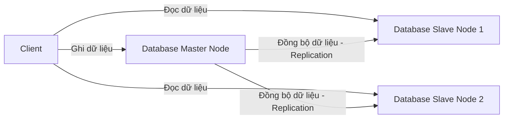

# 🗄️ Kiến Trúc Cơ Sở Dữ Liệu (Database Architecture Design)

Cơ sở dữ liệu (Database) là trái tim của hệ thống phần mềm và thường là điểm nghẽn cổ chai (Bottleneck) lớn nhất của toàn hệ thống. System Architect cần hiểu cách thiết kế lưu trữ để hệ thống đạt hiệu năng và độ ổn định tối ưu.

---

## 🎯 Phân Nhóm Hệ Quản Trị CSDL

1. **CSDL Quan Hệ (Relational Database - SQL)**:
   * *Đại diện*: MariaDB, MySQL, PostgreSQL.
   * *Ưu điểm*: Đảm bảo tính nhất quán dữ liệu cao (ACID), hỗ trợ các truy vấn phức tạp (JOIN).
   * *Phù hợp*: Hệ thống thanh toán, E-commerce, Quản lý tài khoản.

2. **CSDL Phi Quan Hệ (Non-relational Database - NoSQL)**:
   * *Đại diện*: MongoDB, Redis, Cassandra.
   * *Ưu điểm*: Ghi dữ liệu tốc độ cực nhanh, lưu trữ dữ liệu dạng Key-Value, Document hoặc Graph linh hoạt, dễ dàng Scale ngang.
   * *Phù hợp*: Hệ thống cache, log collector, chat thời gian thực.

---

## 🗺️ Mô Hình Đồng Bộ Dữ Liệu (Master-Slave Replication)

---

## 🔗 Liên Kết Thực Hành DevOps
Tham khảo cách triển khai lưu trữ dữ liệu bền vững và thiết lập Database Cluster trong cụm Kubernetes của bạn:

*   **Database StatefulSet**: [MariaDB Statefulset Manifest](../../on-premise/kubernetes/statefulset/) (Triển khai ứng dụng Stateful có gắn Volume lưu trữ).
*   **Storage & PV/PVC**: [Persistent Volume (PV) và Persistent Volume Claim (PVC)](../../on-premise/kubernetes/storage/) (Giải pháp gắn vùng lưu trữ NFS dùng chung cho Pod).
*   **NoSQL / Caching**: [Redis Sentinel Deployment](../../on-premise/kubernetes/redis/) (Sử dụng Redis làm tầng đệm lưu trữ dữ liệu truy xuất nhanh).
